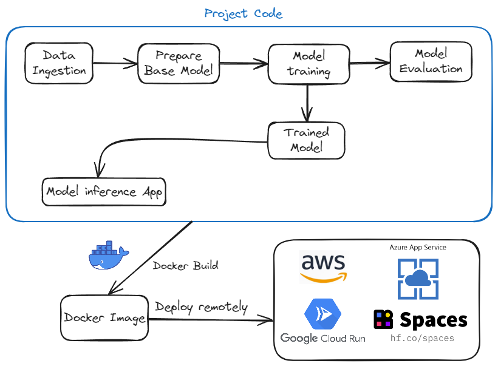
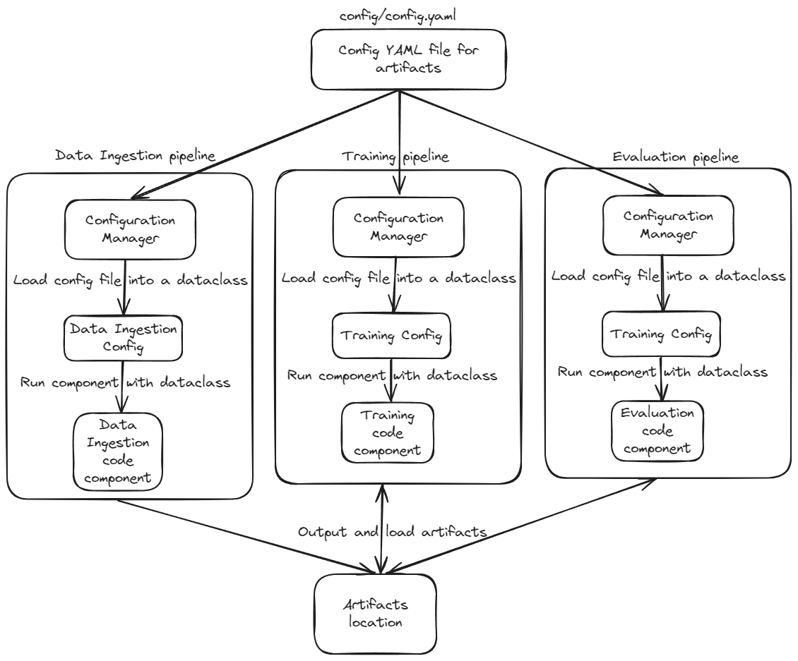

# End to end deep learning pipeline project 

## Intro



This project demonstrates how to create data ingestion, model training, evaluation and prediction pipelines. An app is also built using Gradio to interact with the model locally using a simple interface. A dockerfile is also provided to build a docker image of the project. The docker image was deployed in a Google Cloud Run service to test the remote app deployability. Alternatively the model was also deployed to an Hugging Face space. This is a template project to use for any machine learning pipeline and prediction app.
# How to run the project?

### STEP 01 - Clone the repository
```bash
git clone https://github.com/Hbvsa/End_to_end_DL_Template_Project.git
```
### STEP 02 - Install the requirements
```bash
pip install -r requirements.txt
```
### STEP 03- Run the training pipeline
```bash
python main.py
```
### STEP 04 - Run the app
```bash
python app.py
```

# Project Template Explanation


The yaml config file located in the config/config.yaml path is responsible for indicating where all the artifacts (e.g., dataset, model weights...) will be loaded from and stored. The yaml config file located at params.yaml indicates the model training parameters.The configuration manager class in src/cnnClassifier/config/configuration.py loads this config file and returns a class with the necessary parameters for each different code step.

Each pipeline invokes the Configuration Manager to retrieve the artifacts paths and parameters for each component and executes the components with those inputs. All the pipelines are then run in sequence in the main.py. The config file makes it so that we can setup how the pipelines are able to share the artifacts produced by one another beforehand.

The pipelines can also be ran with DVC (data version control system) by executing the following commands (which config file is already provided in dvc.yaml). DVC caches previous pipelines runs so that if the code has not changed and artifacts are already available it skips those steps making it faster.
```bash
dvc init
dvc repro
dvc dag
```


# Docker

The dockerfile in question works but is not optimized if the objective is just running the app. To create a lighter image please consider creating a folder with just the following files:
- app.py
- model.h5 (will be at End_to_end_chicken\artifacts\training after running the training pipeline)
- requirements.txt
- Dockerfile

To test deploying the model in a easy and straightforward way copy the 4 files into a HuggingFace space for docker https://huggingface.co/docs/hub/spaces-sdks-docker and edit the dockerfile with the following config.
```
FROM python:3.11

RUN useradd -m -u 1000 user
USER user
ENV HOME=/home/user \
	PATH=/home/user/.local/bin:$PATH

WORKDIR $HOME/app
COPY --chown=user . $HOME/app
RUN pip install --no-cache-dir -r requirements.txt
EXPOSE 7860
ENV GRADIO_SERVER_NAME="0.0.0.0"

CMD ["python", "app.py"]
```
